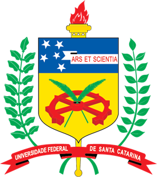

# Prova Estagio Núcleo Ressacada de Pesquisas em Meio Ambiente

 
Inicialmente Fui começando a fazer as funções básicas e organização dos arquivos até empacar e ter que olhar a documentação , Demorou para eu pegar a ideia de como fazer o programa pegar a lista de 1 produto completo porém de resto é igual. 

**1.0- funções Básicas 
1.2 - Achar meio de Arrumar 1 produto em 1 id da lista 
1.25 - Clientes,funcionarios,Produtos funcionando  **
1.4 - Arrumar o arquivo Vendas 
1.45 - Estilizar 
1.5 - Programa Completo 

Divertido eu diria mesmo não completando como queria o Projeto devo continuar e tentar fazer funcionar completamente. 
# Proposta do teste

<a href="https://github.com/RithonBR/ProvaEstagio/blob/master/arquivoSobreTeste/Test%20Position%202.pdf">aqui</a>